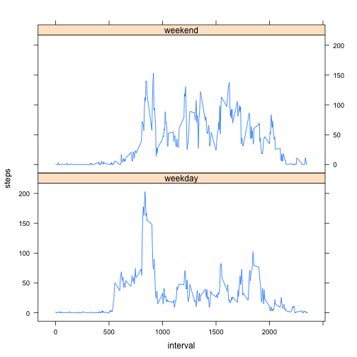

# Reproducible Research: Peer Assessment 1


## Loading and preprocessing the data
Loading data from csv file

```r
data <- read.csv(file="activity.csv",head=TRUE,sep=",")
```

Calculating the total_steps for each interval

```r
total_steps <- tapply(data$steps, data$date, FUN=sum, na.rm=TRUE)
```

## What is mean total number of steps taken per day?
Making a histogram of the total number of steps taken each day

```r
hist(total_steps, breaks=10)
```

 

The mean and the median value

```r
m <- mean(total_steps, na.rm=TRUE)
```
The mean of total number of steps each day is 9354


```r
m <- median(total_steps, na.rm=TRUE)
```
The median of total number of steps each day is 10395

## What is the average daily activity pattern?
Calculating the average daily steps

```r
daily_ave <- aggregate(steps ~ interval, data, FUN=mean, na.rm=TRUE)
```

Making time series graph

```r
plot(daily_ave$interval, daily_ave$steps, type="l", xlab="interval",
     ylab="average steps per day")
```

 

Caculating the max value

```r
m <- which.max(daily_ave$steps)
a <- daily_ave$interval[m-1]
b <- daily_ave$interval[m]
max_interval <- c(a, b)
```
The interval which has the maximal number of steps is [830, 835].

## Imputing missing values
Filling the missing value (NA) with the mean of the steps per day. (0 if all value in that day is NA)

```r
data$steps[is.na(data$steps)] <-
ave(data$steps, data$date, 
    FUN=function(x) {
        m <- mean(x, na.rm=TRUE)
        ifelse (is.nan(m), 0, m)
    })[is.na(data$steps)]
```

Calculating the total steps with new data.

```r
total_steps <- tapply(data$steps, data$date, FUN=sum)
```

Making a histogram of the total number of steps taken each day for new data

```r
hist(total_steps, breaks=10)
```

 

Calculating the mean and median

```r
m <- mean(total_steps)
```
The mean of total number of steps each day is 9354


```r
m <- median(total_steps)
```
The median of total number of steps each day is 10395

Since we fill the missing value with the mean of steps of each day, there is not different in the mean and the median between using the imputing data and using the original data. So there is not any impact of the imputing data.

## Are there differences in activity patterns between weekdays and weekends?
Add new column to the imputing data indicating whether it is weekday or weekend

```r
data$weekday <- !(weekdays(as.Date(data$date)) %in% c("Saturday", "Sunday"))
```

Calculating the average daily steps for weekday and plot

```r
daily_ave <- aggregate(steps[data$weekday] ~ interval[data$weekday], 
                       data, FUN=mean)
plot(daily_ave$interval, daily_ave$steps, type="l", xlab="interval",
     ylab="average steps per day", main="Weekday")
```

 

Calculating the average daily steps for weekend and plot

```r
daily_ave <- aggregate(steps[!data$weekday] ~ interval[!data$weekday], 
                       data, FUN=mean)
plot(daily_ave$interval, daily_ave$steps, type="l", xlab="interval",
     ylab="average steps per day", main="Weekend")
```

 
